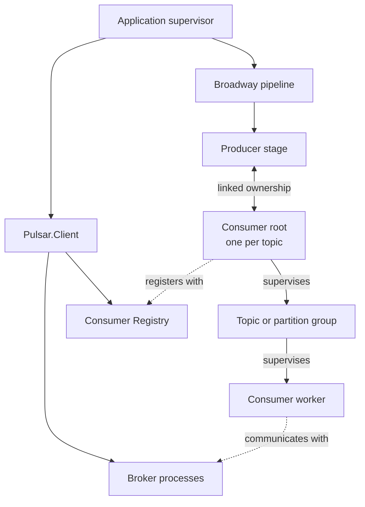

# Broadway Producer for Apache Pulsar

[](https://github.com/efcasado/off_broadway_pulsar/actions/workflows/ci.yml)
[](https://coveralls.io/github/efcasado/off_broadway_pulsar?branch=main)
[](https://hex.pm/packages/off_broadway_pulsar)
[](https://hexdocs.pm/off_broadway_pulsar/)

A [Broadway](https://github.com/dashbitco/broadway) producer for [Apache Pulsar](https://pulsar.apache.org/), built on top of [pulsar-elixir](https://github.com/efcasado/pulsar-elixir/).

## Installation

Add `:off_broadway_pulsar` to your dependencies in `mix.exs`:

```elixir
def deps do
  [
    {:off_broadway_pulsar, "~> 1.5.1"} <!-- x-release-please-version -->
  ]
end
```

## Quick Start

Supervise a `Pulsar.Client` alongside your pipeline — the producer attaches its consumers
to it, so the connection is shared by every producer stage and outlives any one of them:

```elixir
children = [
  {Pulsar.Client, host: "pulsar://localhost:6650"},
  MyApp.PulsarPipeline
]
```

Then, assuming Pulsar is running on `localhost:6650`:

```elixir
defmodule MyApp.PulsarPipeline do
  use Broadway

  def start_link(_opts) do
    Broadway.start_link(__MODULE__,
      name: __MODULE__,
      producer: [
        module: {OffBroadway.Pulsar.Producer,
          topics: ["persistent://public/default/my-topic"],
          subscription: "my-subscription"
        },
        concurrency: 1
      ],
      processors: [
        default: [concurrency: 10]
      ],
      batchers: [
        default: [
          batch_size: 100,
          batch_timeout: 1000
        ]
      ]
    )
  end

  @impl true
  def handle_message(_processor, message, _context) do
    IO.inspect(message.data, label: "Received")
    message
  end

  @impl true
  def handle_batch(_batcher, messages, _batch_info, _context) do
    IO.inspect(length(messages), label: "Batch size")
    messages
  end
end
```

The client defaults to `:default`. Name it to run more than one, or to consume from more
than one cluster, and select it with `:client`:

```elixir
children = [
  {Pulsar.Client, name: :analytics, host: "pulsar://analytics:6650"},
  MyApp.AnalyticsPipeline
]

producer: [
  module: {OffBroadway.Pulsar.Producer,
    client: :analytics,
    topics: ["persistent://public/default/my-topic"],
    subscription: "my-subscription"
  },
  concurrency: 1
]
```

## Configuration

`:topics` and `:subscription` are required. `:client` selects which running `Pulsar.Client`
to attach to, the `:flow_*` options tune read-ahead, `:active_state_callback` observes
failover transitions, and `:consumer_opts` is forwarded to `Pulsar.Consumer`.

Options are validated when the stage starts, so a misconfigured pipeline fails at boot rather
than at the first message. The
[producer documentation](https://hexdocs.pm/off_broadway_pulsar/OffBroadway.Pulsar.Producer.html#start_link/1)
lists every option with its type and default.

### Flow control

The `:flow_*` options replace the consumer's own automatic refills. Each consumer grants its
full `:flow_initial` window as soon as it subscribes — before Broadway has asked for
anything — and the producer grants every refill after that, sized to what Broadway has
actually taken. Read-ahead is therefore bounded by the permit window rather than by pipeline
demand: messages delivered ahead of demand wait in the producer's buffer. Each consumer
keeps its own window — one per topic, and one per partition of a partitioned topic — and
each producer stage has its own consumers, so size `:flow_initial` with that total in mind.

### Consumer options

`:consumer_opts` is forwarded to every consumer the stage starts.
[`Pulsar.Consumer`](https://hexdocs.pm/pulsar_elixir/Pulsar.Consumer.html) documents and
validates the keys it accepts, so they are deliberately not mirrored here. Setting the option
replaces the default rather than merging into it.

The keys the producer sets for itself — the topic, subscription, callback module, consumer
count and flow settings — are rejected, each naming the option that does work instead: use
`producer: [concurrency: N]` for the consumer count, and the `:flow_*` options above for flow
control.

### Failover active state

`:active_state_callback` is invoked as `apply(module, function, [metadata | extra_args])`,
where `metadata` carries the active state, the topic or partition, the subscription and the
consumer pid. It runs synchronously in the Pulsar consumer, so it should return promptly.
Reports are best-effort observations — they may repeat, and they are not a distributed lock
or fencing mechanism. The
[producer documentation](https://hexdocs.pm/off_broadway_pulsar/OffBroadway.Pulsar.Producer.html#start_link/1)
has the complete callback contract.

## Architecture and failure propagation

Broadway and pulsar-elixir have different lifecycle boundaries. The `Pulsar.Client` owns
shared connection infrastructure; each Broadway producer stage owns the consumers that feed
it. A consumer root therefore uses the client's infrastructure without being a child of the
client's consumer `DynamicSupervisor`.



| Event | Result |
| --- | --- |
| The producer stage exits | Its linked consumer roots stop |
| A consumer root exits | Its link or monitor stops the stage; Broadway recreates it |
| A retryable worker failure occurs | Pulsar's topology supervision restarts the worker |
| A terminal subscription error stops a group | The stage's health check detects it and restarts |
| The consumer Registry is replaced | Existing roots keep running by pid, but their former names no longer resolve |
| A broker connection fails | The affected workers restart and reconnect through the client |

Because the roots belong to their producer stages, `Pulsar.Client.consumers/1` does not list
them. Stop the Broadway pipeline, rather than an individual root, to stop them permanently.

## Message metadata

Each `Broadway.Message` carries its Pulsar origin and message fields in `:metadata`:

```elixir
def handle_message(_processor, message, _context) do
  %{
    topic: topic,          # resolved topic; the concrete partition if partitioned
    base_topic: base,      # the configured topic
    partition: partition,  # partition index, or nil
    key: key,
    properties: properties
  } = message.metadata

  message
end
```

See the [producer documentation](https://hexdocs.pm/off_broadway_pulsar/OffBroadway.Pulsar.Producer.html#module-message-metadata)
for the full list.

## Examples

The `examples/` directory contains self-contained, end-to-end scripts. With a local
Pulsar running (`make up`), run them with plain `elixir`:

- `examples/atproto.exs` — consumes the public [AT Protocol feed](https://github.com/bluesky-social/jetstream) over a websocket,
republishes every event to Pulsar, and computes live stream statistics (posting activity, languages, trending hashtags, most liked/reposted posts).

```sh
make up
elixir examples/atproto.exs
```
